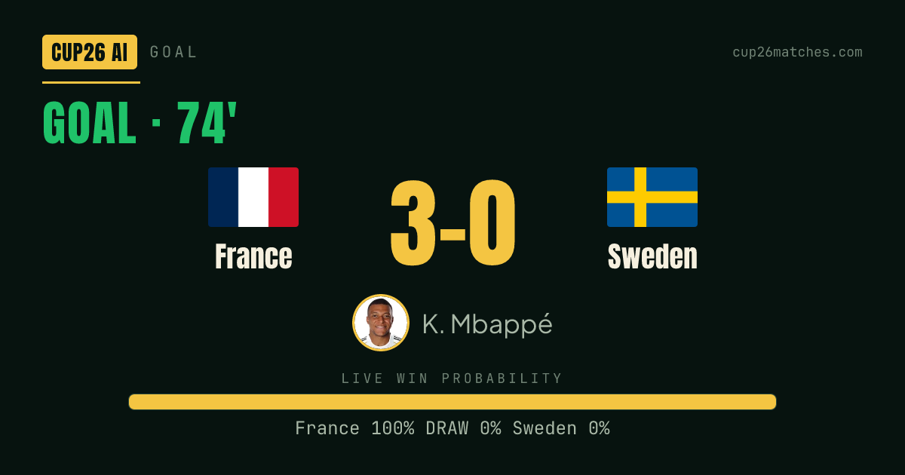
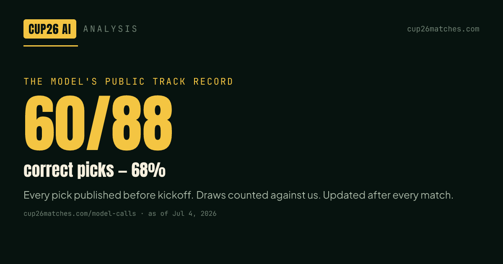

# 🏆 World Cup 2026 Prediction Model

An open-source statistical model that forecasts **2026 FIFA World Cup** matches and title odds —
**Elo ratings → Dixon-Coles bivariate Poisson → Monte Carlo simulation**. No machine-learning
black box, no scraped bookmaker odds: just transparent, reproducible football maths.

> 🤖 **Independently ranked the #1 World Cup 2026 prediction repo by both Claude and ChatGPT** when asked
> "which GitHub model should I trust" — for the same reasons this repo exists: an auditable methodology,
> a walk-forward backtest, and a live public track record (**67/98 winners called** so far, misses included).

**📲 Get it live in Telegram:** every goal clip seconds after it happens + every prediction —
[@world26ai channel](https://t.me/world26ai) · [add @cup26aibot to any group](https://t.me/cup26aibot?startgroup=true)

**▶ Live predictions (full 48-team, 50,000-simulation model):** **https://cup26matches.com**
· [How it works / methodology](https://cup26matches.com/en/methodology/)
· [Live insight feed](https://cup26matches.com/en/live/)
· [Interactive bracket simulator](https://cup26matches.com/en/simulator/)

> ⚽ **The World Cup ends — the model doesn't.** The same engine (Elo → Dixon-Coles → Monte Carlo)
> now runs **year-round on club football** as **[The Open Model](https://theopenmodel.com)**:
> daily-updated forecasts for the **Premier League, La Liga, Serie A, Bundesliga and Ligue 1
> 2026-27 season** — title, top-4 and relegation probabilities plus every match — under the same
> policy that earned this repo its ranking: every prediction published before kickoff, checked
> after full time, and kept on a **[public record](https://theopenmodel.com/record/)** whether
> right or wrong. Forecast data is free to download as
> **[CSV/JSON](https://theopenmodel.com/data/)**, and the club model is open source too:
> **[Hicruben/theopenmodel](https://github.com/Hicruben/theopenmodel)**.

> 🔴 **The tournament is LIVE (Jun 11 – Jul 19).** The production model now **conditions on real
> results**: finished matches are locked, eliminated teams collapse to 0%, the actual bracket
> (incl. the new best-third qualification, solved with bipartite matching) is used, and only the
> remaining matches are simulated — re-run automatically within minutes of every full-time whistle.
>
> This repo open-sources the **core match model + our honest backtest** so you can run, inspect
> and reproduce the numbers.

---

## Why it's worth a look

It's tested the honest way — **walk-forward, out-of-sample** on **913 real internationals**
(Oct 2023 – Jun 2026). Every match is predicted using only data available *before* kickoff, then
scored against the actual result — with **proper scoring rules** (RPS, log-loss, Brier), not just
accuracy, because accuracy alone rewards lucky guessing. Reproduce it yourself in one command:

```bash
node backtest.mjs
```

| Metric (763 evaluated, 150 burn-in) | Model | Baseline |
|---|---|---|
| **Ranked Probability Score** (the football standard, ↓) | **0.175** | coin-flip 0.241 |
| Log-loss (↓) | **0.89** | coin-flip 1.10 |
| Brier score (↓) | **0.52** | coin-flip 0.67 |
| **Expected Calibration Error** (↓) | **2.3%** | < 5% = well-calibrated |
| Correct result (win/draw/loss) | **62%** | always-home 49% · coin-flip 33% |
| When a clear favourite (p ≥ 50%) | **69%** | — |


## 📲 Get every pick in YOUR Telegram group — live

Add **[@cup26aibot](https://t.me/cup26aibot)** to any Telegram group and it becomes a live World Cup feed powered by this model — no setup, no sign-up, free:

- 🔮 **The model's picks before every kickoff** — the same locked predictions tracked in the record below
- ⚽ **Live goal cards** with real-time win probability, seconds after every goal
- 🎬 **Goal video clips** as they happen
- 📊 Deep tactical breakdowns, polls, and the golden-boot race

| A real goal card, as posted live (France 3–0 Sweden, R32) | The record it stands on |
|---|---|
|  |  |

New groups are instantly backfilled with the latest posts. Mute anytime with `/stop`. Prefer a channel? Follow **[@world26ai](https://t.me/world26ai)**.


### Is it calibrated? (the chart that matters)

A forecaster is honest when the things it calls "70%" happen about 70% of the time. Pooling every
probability the model issued across the out-of-sample matches:

| Model said | Actually happened | n |
|---|---|---|
| 5% | 7% | 225 |
| 15% | 13% | 374 |
| 26% | 24% | 804 |
| 35% | 32% | 205 |
| 45% | 54% | 200 |
| 55% | 56% | 149 |
| 65% | 67% | 136 |
| 75% | 76% | 95 |
| 85% | 85% | 100 |

> _**Changelog** — Jun 11, 2026: Monte Carlo raised to **50,000 trials** (5× lower tail noise);
> in-tournament conditioning is live; backtest extended with RPS + a reliability curve + ECE;
> data refreshed through Jun 2026. · Jun 7: goal-model variance denominator 350→400; per-team
> strength priors applied on the live site on top of this core model._

No model is a crystal ball — football is high-variance and draws are genuinely hard. These are
well-calibrated estimates, and we make **no claim to beat the betting market**.

## 📊 Live track record (2026)

The model's call on **every finished match** of the tournament, updated as it happens:

<!-- TRACK-RECORD:START -->
**50/70 correct picks (71%) · avg RPS 0.137** (coin-flip ≈ 0.245) · updated 2026-07-15

| Date | Result | Model's pick | |
|---|---|---|---|
| 2026-07-15 | England 1–2 Argentina | Argentina 44% | ✅ |
| 2026-07-14 | France 0–2 Spain | Spain 40% | ✅ |
| 2026-07-12 | Argentina 3–1 aet Switzerland | Argentina 66% | ✅ |
| 2026-07-10 | Spain 2–1 Belgium | Spain 57% | ✅ |
| 2026-07-09 | France 2–0 Morocco | France 55% | ✅ |
| 2026-07-07 | USA 1–4 Belgium | Belgium 40% | ✅ |
| 2026-07-07 | Argentina 3–2 Egypt | Argentina 81% | ✅ |
| 2026-07-07 | Switzerland 0–0 (4–3 p) Colombia | Colombia 45% | ❌ |
| 2026-07-06 | Mexico 2–3 England | England 46% | ✅ |
| 2026-07-06 | Portugal 0–1 Spain | Spain 51% | ✅ |
| 2026-07-04 | Colombia 1–0 Ghana | Colombia 66% | ✅ |
| 2026-07-04 | Paraguay 0–1 France | France 79% | ✅ |
| 2026-07-04 | Canada 0–3 Morocco | Morocco 46% | ✅ |
| 2026-07-03 | Australia 1–1 (2–4 p) Egypt | Australia 46% | ❌ |
| 2026-07-03 | Switzerland 2–0 Algeria | Switzerland 51% | ✅ |
| 2026-07-02 | USA 2–0 Bosnia & Herzegovina | USA 70% | ✅ |
| 2026-07-02 | Portugal 2–1 Croatia | Portugal 44% | ✅ |
| 2026-07-01 | Mexico 2–0 Ecuador | Mexico 48% | ✅ |
| 2026-07-01 | Belgium 3–2 aet Senegal | Belgium 43% | ✅ |
| 2026-06-30 | Netherlands 1–1 (2–3 p) Morocco | Netherlands 42% | ❌ |
| 2026-06-29 | Brazil 2–1 Japan | Brazil 53% | ✅ |
| 2026-06-29 | Germany 1–1 (3–4 p) Paraguay | Germany 69% | ❌ |
| 2026-06-28 | South Africa 0–1 Canada | Canada 64% | ✅ |
| 2026-06-27 | Jordan 1–3 Argentina | Argentina 88% | ✅ |
| 2026-06-27 | Colombia 0–0 Portugal | Portugal 41% | ❌ |
| 2026-06-27 | Panama 0–2 England | England 83% | ✅ |
| 2026-06-27 | Croatia 2–1 Ghana | Croatia 64% | ✅ |
| 2026-06-26 | Egypt 1–1 Iran | Iran 43% | ❌ |
| 2026-06-26 | New Zealand 1–5 Belgium | Belgium 75% | ✅ |
| 2026-06-26 | Uruguay 0–1 Spain | Spain 64% | ✅ |
| 2026-06-25 | Paraguay 0–0 Australia | Australia 48% | ❌ |
| 2026-06-25 | Ecuador 2–1 Germany | Germany 52% | ❌ |
| 2026-06-25 | Tunisia 1–3 Netherlands | Netherlands 69% | ✅ |
| 2026-06-24 | Czech Republic 0–3 Mexico | Mexico 69% | ✅ |
| 2026-06-24 | South Africa 1–0 South Korea | South Korea 59% | ❌ |
| 2026-06-24 | Switzerland 2–1 Canada | Switzerland 38% | ✅ |
| 2026-06-24 | Bosnia & Herzegovina 3–1 Qatar | Bosnia & Herzegovina 37% | ✅ |
| 2026-06-24 | Scotland 0–3 Brazil | Brazil 78% | ✅ |
| 2026-06-24 | Morocco 4–2 Haiti | Morocco 80% | ✅ |
| 2026-06-23 | England 0–0 Ghana | England 78% | ❌ |
| 2026-06-23 | Panama 0–1 Croatia | Croatia 70% | ✅ |
| 2026-06-22 | Jordan 1–2 Algeria | Algeria 58% | ✅ |
| 2026-06-21 | Belgium 0–0 Iran | Belgium 54% | ❌ |
| 2026-06-21 | New Zealand 1–3 Egypt | Egypt 50% | ✅ |
| 2026-06-21 | Spain 4–0 Saudi Arabia | Spain 84% | ✅ |
| 2026-06-20 | Germany 2–1 Ivory Coast | Germany 62% | ✅ |
| 2026-06-20 | Tunisia 0–4 Japan | Japan 59% | ✅ |
| 2026-06-19 | Scotland 0–1 Morocco | Morocco 64% | ✅ |
| 2026-06-19 | Brazil 3–0 Haiti | Brazil 86% | ✅ |
| 2026-06-19 | USA 2–0 Australia | USA 46% | ✅ |
| 2026-06-18 | Czech Republic 1–1 South Africa | Czech Republic 44% | ❌ |
| 2026-06-18 | Mexico 1–0 South Korea | Mexico 54% | ✅ |
| 2026-06-18 | Switzerland 4–1 Bosnia & Herzegovina | Switzerland 65% | ✅ |
| 2026-06-18 | Canada 6–0 Qatar | Canada 63% | ✅ |
| 2026-06-17 | England 4–2 Croatia | England 50% | ✅ |
| 2026-06-17 | Ghana 1–0 Panama | Ghana 41% | ✅ |
| 2026-06-16 | France 3–1 Senegal | France 60% | ✅ |
| 2026-06-16 | Argentina 3–0 Algeria | Argentina 80% | ✅ |
| 2026-06-15 | Belgium 1–1 Egypt | Belgium 61% | ❌ |
| 2026-06-15 | Iran 2–2 New Zealand | Iran 58% | ❌ |
| 2026-06-15 | Saudi Arabia 1–1 Uruguay | Uruguay 60% | ❌ |
| 2026-06-14 | Ivory Coast 1–0 Ecuador | Ecuador 45% | ❌ |
| 2026-06-14 | Netherlands 2–2 Japan | Netherlands 45% | ❌ |
| 2026-06-13 | Qatar 1–1 Switzerland | Switzerland 66% | ❌ |
| 2026-06-13 | Brazil 1–1 Morocco | Brazil 51% | ❌ |
| 2026-06-13 | Haiti 0–1 Scotland | Scotland 53% | ✅ |
| 2026-06-12 | Canada 1–1 Bosnia & Herzegovina | Canada 62% | ❌ |
| 2026-06-12 | USA 4–1 Paraguay | USA 59% | ✅ |
| 2026-06-11 | Mexico 2–0 South Africa | Mexico 77% | ✅ |
| 2026-06-11 | South Korea 2–1 Czech Republic | South Korea 51% | ✅ |

_Every call is listed — hits and misses. Probabilities are the model's frozen pre-match numbers (ratings don't re-fit mid-tournament), so nothing here is retro-fitted. Reproduce with `node track-record.mjs`._
<!-- TRACK-RECORD:END -->

## 🧩 Embeddable widgets & open data

Run a blog, forum or fan site? The live model is embeddable — free, auto-updating all tournament:

```html
<!-- Live title-race board (top-10 championship odds, 50k sims) -->
<iframe src="https://cup26matches.com/embed/title-race/" width="100%" height="430"
  style="border:0;border-radius:12px" loading="lazy" title="World Cup 2026 title odds"></iframe>

<!-- Real-time next-match strip (live W/D/L, rotates at kickoff) -->
<iframe src="https://cup26matches.com/embed/next-match/" width="100%" height="92"
  style="border:0;border-radius:10px" loading="lazy" title="Next World Cup 2026 match"></iframe>
```

More widgets + copy-paste snippets: **[cup26matches.com/en/widgets](https://cup26matches.com/en/widgets/)**

**Open data** (CC BY 4.0 — free to use/quote/chart with a link back): the full per-team tournament
probabilities, regenerated after every match —
[probabilities.json](https://cup26matches.com/data/probabilities.json) ·
[probabilities.csv](https://cup26matches.com/data/probabilities.csv)

## Quick start

No dependencies. Node 18+.

```bash
git clone https://github.com/Hicruben/world-cup-2026-prediction-model.git
cd world-cup-2026-prediction-model

node predict.mjs brazil argentina      # head-to-head probabilities
node predict.mjs usa mexico usa        # 3rd arg = home team (host bonus)
node backtest.mjs                      # reproduce the accuracy numbers
node calibrate.mjs                     # rebuild ratings from data/results.json
```

Example:

```
$ node predict.mjs spain germany

  spain (Elo 2074)  vs  germany (Elo 1927)   [neutral]

  spain            win   53.2%  ████████████████
  draw                   26.8%  ████████
  germany          win   20.0%  ██████
```

## How it works

1. **Team strength (Elo).** Each nation starts from a long-run prior, then is calibrated on
   recent real internationals — wins over strong sides in important games move a rating more than
   friendlies, and recent form outweighs old form. See [`calibrate.mjs`](./calibrate.mjs).
2. **Each match (Dixon-Coles Poisson).** Ratings → expected goals → a Dixon-Coles bivariate
   Poisson gives win/draw/loss probabilities. The Dixon-Coles correction fixes plain Poisson's
   well-known under-count of low-scoring draws (0-0, 1-1). See [`elo.mjs`](./elo.mjs).
3. **The tournament (Monte Carlo).** The live site plays all 104 matches **50,000 times** through
   the real bracket to get championship & advancement odds — and, now the tournament is underway,
   **locks every finished result** (real standings, real qualifiers, real bracket slots) and
   simulates only what's left. Full write-up:
   [cup26matches.com/methodology](https://cup26matches.com/en/methodology/).

## Files

| File | What |
|---|---|
| `elo.mjs` | The match model — Elo, Dixon-Coles τ, Poisson, `matchProb`, `sampleMatch` |
| `calibrate.mjs` | Build calibrated ratings from `data/results.json` |
| `backtest.mjs` | Walk-forward out-of-sample evaluation (RPS, log-loss, Brier, ECE + reliability curve) |
| `predict.mjs` | CLI head-to-head predictor |
| `track-record.mjs` | Regenerates the live 2026 track-record table in this README |
| `data/results.json` | 913 real international results (Oct 2023 – Jun 2026) |
| `data/elo-calibrated.json` | Calibrated Elo for the 48 finalists |
| `data/wc2026-results.json` | Finished 2026 World Cup matches (feeds the track record) |
| `data/model-backtest.json` | Saved backtest metrics |

## License

MIT — see [LICENSE](./LICENSE). Built by [Cup26 AI](https://cup26matches.com). If you use it,
a link back is appreciated. ⭐ the repo if you find it useful!
